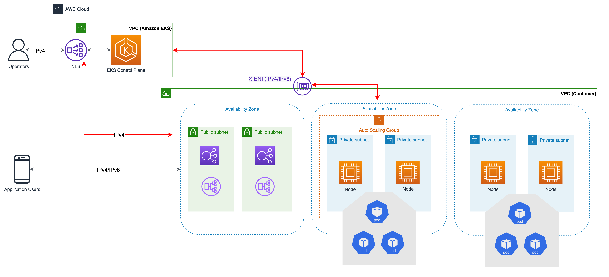

# Folder Structure Conventions
The idea of this repo is to show how you can structure files for IaC and deploy applications/tools by ArgoCD, Helm Charts

**Step to run**
- Firstly, run code into `terraform` folder to have infrastructure (VPC, EKS, ArgoCD) for CD applications
- After that, follow `README.md` into folder `deployment` to create Applications

## terraform folder
- Store IaC code 
- The Architecture of AWS EKS

 
## helm-charts folder
- Store helm chart of Web app stack (MongoDB, Web App) and monitoring/logging tools (Elasticsearch, Kibana, Filebeat, Logstash, Prometheus, Grafana, AlertManager)

## deployment folder
- Use to deploy applications into `helm-charts` folder on EKS Cluster by ArgoCD App-of-apps pattern
