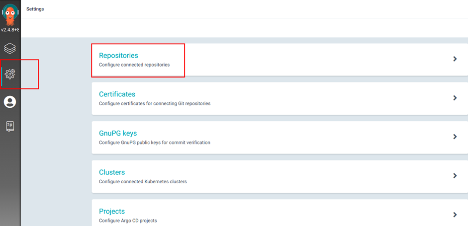

# Deployment applications and tools
## ArgoCD app-of-apps pattern
### Pre-install
- Add GitOps public repo `devops-elsa-exam` with URL https://github.com/triethuynh1408/devops-elsa-exam.git into ArgoCD 

### Structure
#### app-of-apps folder
- Store main app by file `dev-main-apps.yaml`
- Create it by manual apply
    ```
    kubectl apply -f dev-main-apps.yaml
    ```
#### env/dev folder
- Store file `backend.yaml` to declare child apps with helm charts paths
- Sync child apps from main app and they will be deployed 